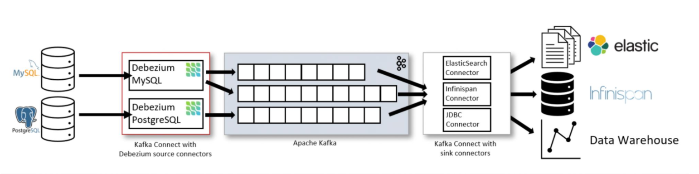
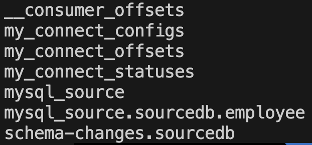
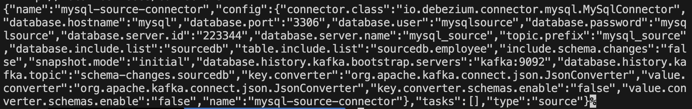
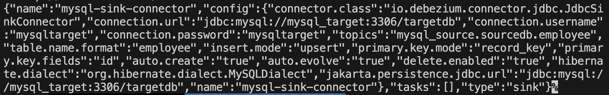
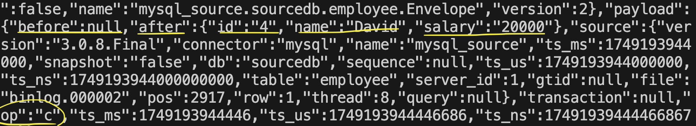
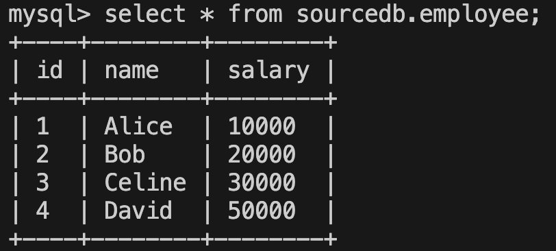
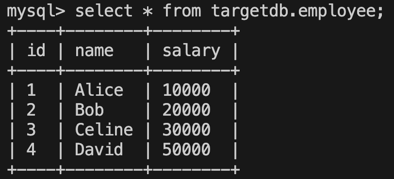
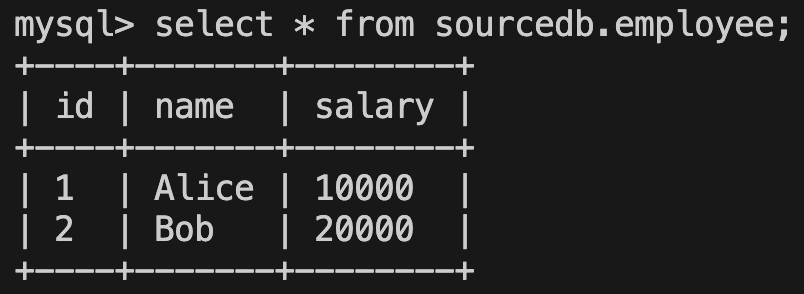
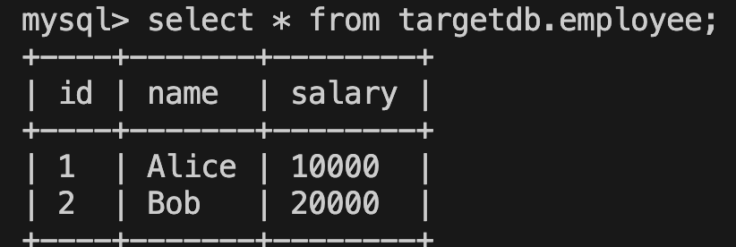

# CDC_with_Debezium

This is a tutorial to make CDC pipeline with Debezium to sync data between 2 mysql databases, one as a source DB and the other as a target DB.


#### CDC Pipeline 



Debezium can use various types of DB, like mysql and postgresql, as a source DB, since it provides with various types of source connectors that support various types of DB. 

These connectors, plugins built on top of Kafka Connect, facilitate the integration of Kafka with other data systems by capturing and streaming change data in real time.

Then data changes are published to Kafa topics and are consumed by sink connectors, writing the data to external systems like files, DB, and DW.


### 1. Start with running 5 docker containers:

```
> docker-compose -f docker-compose.yaml up -d
```

- zookeeper
- kafka
- kafka-connect
- mysql-source
- Mysql-target


### 2. Configuring for mysql source DB

```
> docker exec -it mysql_source bash
```

```
> mysql -u root -p
```

```
> CREATE DATABASE sourcedb;
> use sourcedb;
```

```
> GRANT ALL PRIVILEGES ON *.* TO 'mysqlsource'@'%';
> FLUSH PRIVILEGES;
```


```
> CREATE TABLE employee ( 
  id VARCHAR(255),
  name VARCHAR(255), 
  salary VARCHAR(255), 
  PRIMARY KEY (id)
  );
```

```
> INSERT INTO employee (id, name, salary) VALUES 
  ('1', 'Alice', '10000'),
  ('2', 'Bob', '20000’);
```


### 3. Configuring for mysql source DB

```
> docker exec -it mysql_target bash
```

```
> mysql -u root -p
```

```
> CREATE DATABASE targetdb; 
> use targetdb;
```

```
> GRANT ALL PRIVILEGES ON *.* TO mysqltarget@'%'; 
> FLUSH PRIVILEGES;
```


```
> CREATE TABLE employee ( 
  id VARCHAR(255),
  name VARCHAR(255), 
  salary VARCHAR(255), 
  PRIMARY KEY (id)
  );
```


#### 4. Create Kaka Topic

```
docker exec -it kafka \
/kafka/bin/kafka-topics.sh \
--create --topic schema-changes.sourcedb \
--bootstrap-server kafka:9092 \ 
--replication-factor 1 \ 
--partitions 1
```

```
docker exec -it kafka /kafka/bin/kafka-topics.sh --list --bootstrap-server kafka:9092
```




#### 5. Register Debezium MySQL connecors

- Source Connector

```
curl -X POST -H "Content-Type: application/json" \ --data @mysql-source-connector.json \ http://localhost:8083/connectors
```



- Sink Connector

```
curl -X POST -H "Content-Type: application/json" \ --data @mysql-sink-connector.json \ http://localhost:8083/connectors
```




#### 6. Test with DML(insert, update, delete)

```
# mysql_source
> INSERT INTO employee (id, name, salary) VALUES 
  ('3', 'Celine', '30000'),
  ('4', 'David', '40000');
```


- checking on kafka message

```
docker exec -it connect /kafka/bin/kafka-console-consumer.sh \ 
--bootstrap-server kafka:9092 \
--topic mysql_source.sourcedb.employee \
--from-beginning
```




```
# mysql_source
> UPDATE employee SET salary = '50000' WHERE id = '4';
```






```
# mysql_source
> DELETE FROM employee WHERE id IN ('3', '4');
```



